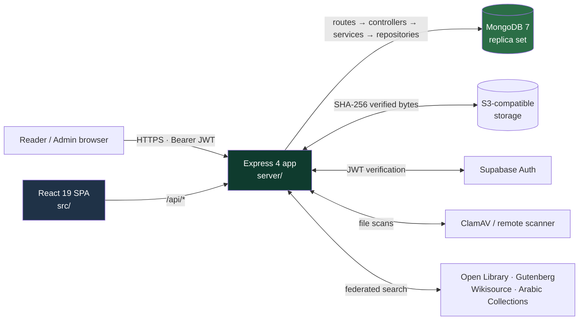
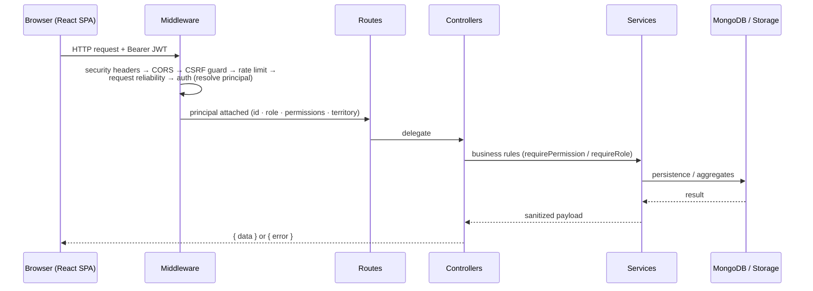
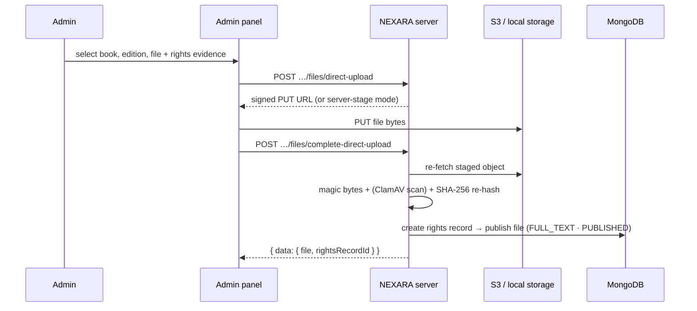

<p align="center">
  
</p>

<div align="center">

# 🌲 NEXARA — A Living Forest of Literature

**A bilingual (English / Arabic) full‑stack digital library and immersive literary forest — deterministic
discovery, a rights‑cleared catalogue, checksum‑verified content, and a distraction‑free reading engine.**

[](https://www.typescriptlang.org/)
[](https://nodejs.org/)
[](https://react.dev/)
[](https://vitejs.dev/)
[](https://expressjs.com/)
[](https://www.mongodb.com/)
[](LICENSE)

[](.github/workflows/acceptance.yml)

</div>

---

## ✨ Table of Contents

1. [Overview](#-overview)
2. [Why NEXARA](#-why-nexara)
3. [Core Features](#-core-features)
4. [Tech Stack](#-tech-stack)
5. [Architecture](#-architecture)
6. [Data Model](#-data-model)
7. [Getting Started](#-getting-started)
8. [Configuration Reference](#-configuration-reference)
9. [Scripts](#-scripts)
10. [API Overview](#-api-overview)
11. [Authentication & Authorization](#-authentication--authorization)
12. [Storage & Uploads](#-storage--uploads)
13. [Security](#-security)
14. [Testing](#-testing)
15. [Deployment](#-deployment)
16. [Project Structure](#-project-structure)
17. [Contributing](#-contributing)
18. [License](#-license)

---

## ✨ Overview

NEXARA is an **open-source digital platform where a carefully curated catalogue of world literature,
classical texts, and philosophy meets an immersive, calming reading experience**. It is a full‑stack
TypeScript application: a reactive single‑page frontend paired with a hardened REST API, built to
prioritize **legal clarity** (verifiable rights metadata), **content integrity** (checksum‑verified
storage), and **reader focus** (a distraction‑free, bilingual engine).

The name reflects the product metaphor: literature as a **living forest** — books are located in themed
regions (_Philosophy, Poetry, River of Stories, Midnight Library, Archive Woods, Open Fields_), each with
its own ambient soundscape. The experience includes deterministic discovery, curated reading paths, a
**literary map**, per‑reader **memory groves**, and a timed **time‑capsule** feature that lets readers
set a book aside until a future date.

<p align="center">
  
</p>

---

## ✨ Why NEXARA

- **🛡️ Legal clarity first.** Every edition carries a verifiable rights status (`PUBLIC_DOMAIN`,
  `OPEN_ACCESS`, `LICENSED`, `PREVIEW_ONLY`, `RESTRICTED`, `UNAVAILABLE`) and no book is ever published
  by a direct API write — publication is gated behind a reviewed, multi-stage ingestion pipeline.
- **🔐 Content integrity you can trust.** Files are SHA‑256 checksummed on upload and re‑verified on every
  stream/download; stored size and checksum must match the database record before a single byte is served.
- **🧘 A calm, opinionated reading experience.** RTL + LTR rendering, themes, fonts, ambient soundscapes,
  a reading ritual, shareable quote cards, and a spatial "forest" instead of a cold grid.
- **🌐 Bilingual by design.** English and Arabic share one model; titles, descriptions, genres, chapters,
  notifications, and reviews all carry parallel `…Ar` fields.
- **📊 Operationally honest.** Structured JSON logging, request tracing, liveness/readiness probes, and a
  phased acceptance suite (P0–P17) enforced in CI.

---

## ✨ Core Features

### 📚 Catalogue & Content
- Books, **works** (groupings), **editions** (multi‑language, multi‑format), chapters, and digital assets.
- `FULL_TEXT` / `PREVIEW` / `METADATA_ONLY` / `UNAVAILABLE` availability model with server‑enforced consistency.
- Full‑text search (MongoDB `$text`), filters by genre/language/year/rights, and deterministic ranking.
- Large catalogues stay light: books with >20 chapters serve chapter stubs and fetch full text on demand.

### 📖 Reading Engine
- Paper / night / forest themes; serif / sans / literary / mono / Amiri fonts.
- Ambient soundscapes (rain, night‑forest, fireplace, wind, library, silence).
- Reading ritual modal, quote studio (export a passage as an image card), and per‑book progress.
- Monotonic progress sync (`clientSequence`) so late‑arriving writes never move progress backwards.

### 🔍 Discovery
- Federated search across **Open Library, Project Gutenberg, Wikisource, and Arabic Collections Online**
  with per‑provider timeouts, bounded retries, and circuit breakers.
- Deterministic identity‑based deduplication and ranking with transparent reasons.
- Curated **reading paths**, a 2‑D **literary map**, mood‑based browsing, and the forest experience.

### 💬 Personal & Community
- Saved shelves, bookmarks, highlights (4 colors + notes), collections.
- Reviews with likes and threaded comments; a community feed.
- Achievements, notifications, and time capsules.

### ⚙️ Platform
- Server‑side role/permission authority (never trusts client claims).
- Reviewed ingestion from Gutenberg / Wikisource / ACO with an admin approval gate.
- S3‑compatible signed‑URL uploads (production) and local filesystem storage (development).
- Optional ClamAV / remote malware scanning with strict upload validation (magic bytes, EPUB zip‑bomb
  checks, HTML sanitization).
- Complete audit trail for rights, downloads, reviews, and role changes.

---

## ✨ Tech Stack

| Layer | Technology |
|---|---|
| **Language** | TypeScript 5.8 (strict) |
| **Frontend** | React 19 · Vite 6 · Tailwind CSS v4 · `motion/react` · lucide‑react |
| **Backend** | Express 4 (REST/JSON) · `tsx` runner |
| **Database** | MongoDB 7 (replica set) · official `mongodb` driver |
| **Auth** | Supabase Auth (production) · scrypt local provider (development) |
| **Object storage** | S3‑compatible (`@aws-sdk/client-s3`) · local filesystem (dev) |
| **Malware scanning** | ClamAV (`clamdscan`) or remote HTTP scanner (Docker) |
| **Build / run** | npm 10+ · Node 22+ · esbuild · Vite |

---

## ✨ Architecture

NEXARA is a **dependency‑injected layered backend** behind a single‑source SPA. Both the API and the
client are served from the same origin.



**Key architectural rules**

- **Server‑side authority.** The bearer token only *authenticates*. Authorization is resolved per request
  from MongoDB `role_assignments`, never from JWT claims or client‑sent roles/ids.
- **One source of truth per aggregate.** Catalogue writes decompose a `Book` into normalized `authors`,
  `works`, `editions`, `book_files`, and `chapters` collections; `books` is the read projection.
- **Publication is gated.** Only the reviewed ingestion pipeline or the direct‑upload completion path
  (rights evidence + validation + malware scan) can flip a record to `PUBLISHED`.
- **Fail‑closed configuration.** Production refuses to start on unsafe combinations (local auth, local
  storage, empty CORS, unscanned uploads).
- **Two runtime shapes, one factory.** `server/runtime/createRuntimeApp.ts` composes the same
  dependency‑injected Express app for a Node process (`server.ts`) and for Vercel serverless
  (`api/index.ts`).

### Request lifecycle



---

## ✨ Data Model

A single MongoDB database (default `nexara`, ~30 collections) across **five concerns**:

| Concern | Collections |
|---|---|
| **Catalogue** | `authors` · `works` · `books` (projection) · `editions` · `book_files` · `chapters` |
| **Identity** | `users` · `local_users` · `local_sessions` · `role_assignments` |
| **Legal** | `rights_records` · `audit_logs` · `download_logs` |
| **Library / Community** | `reading_progress` · `reading_history` · `bookmarks` · `highlights` · `collections` · `reviews` · `review_likes` · `review_comments` |
| **Runtime** | `user_book_states` · `user_achievements` · `notifications` · `time_capsules` · `downloads` · `reading_paths` · `provider_records` · `discovery_cache` · `ingestion_jobs` · `schema_migrations` |

- **Aggregate read, normalized write.** `books` embeds an author snapshot, editions, embedded files, and
  chapter stubs for single‑query reads; writers decompose into the normalized collections.
- **Availabilities & workflow** are server‑enforced: `FULL_TEXT` / `PREVIEW` / `METADATA_ONLY` /
  `UNAVAILABLE` and `WorkflowStatus` `DRAFT → … → PUBLISHED`.
- **Migrations are versioned and checksum‑verified** (`schema_migrations`). The chain is ordered
  `P2 → P3 → P4 → P6 → P8 → P11 → P15`; each step applies JSON‑Schema validators and idempotent indexes,
  then records its id + checksum. Mismatched checksums fail fast to catch schema redefinition or a forked
  database. Back up the database **and** the object store together — `book_files` records only describe
  bytes that live in S3/local storage.

---

## ✨ Getting Started

### Prerequisites

| Tool | Version |
|---|---|
| Node.js | 22+ (CI pins `22.13.0`) |
| npm | 10+ |
| MongoDB | 7.0+ as a **single‑node replica set** (transactions require it) |

### 1 · Clone & install

```bash
git clone https://github.com/Omran-Khaled/Nexara.git
cd Nexara
npm ci --ignore-scripts      # locked install
cp .env.example .env         # then edit; .env is gitignored, never committed
```

### 2 · Configure for local development

```ini
NODE_ENV=development
AUTH_PROVIDER=local
VITE_AUTH_PROVIDER=local
MONGODB_URI=mongodb://127.0.0.1:27017/nexara?replicaSet=rs0&directConnection=true
MONGODB_DB_NAME=nexara
BOOK_STORAGE_PROVIDER=local
# Optional: NEXARA_LOCAL_ADMIN_EMAIL / NEXARA_LOCAL_ADMIN_PASSWORD (both or neither)
```

### 3 · Start MongoDB (replica set)

```bash
mongod --dbpath .data/mongodb --replSet rs0 --port 27017
# once per data directory:
mongosh --port 27017 --eval 'rs.initiate()'
```

### 4 · Migrate the schema

```bash
npm run db:migrate          # applies P2 → P3 → P4 → P6 → P8 → P11 → P15
```

### 5 · Run the development server

```bash
npm run dev                 # Express API + Vite SPA on http://localhost:3000
```

Visit `http://localhost:3000`. The API is served at `/api/*`; the SPA hot‑reloads through Vite
middleware in the same process.

---

## ✨ Configuration Reference

All settings are read from environment variables via `server/config/env.ts`. Copy `.env.example` → `.env`
and fill in real values. `.gitignore` ignores `.env*` (only `.env.example` is tracked).

### Server
| Variable | Description | Default |
|---|---|---|
| `PORT` | HTTP listen port (1..65535). | `3000` |
| `NODE_ENV` | `development` · `test` · `production` — enables hard production gates. | `development` |
| `NEXARA_TRUST_PROXY_HOPS` | Trusted reverse proxies in front of Express (0..10). | `0` (prod `1`) |
| `NEXARA_STARTUP_READINESS_REQUIRED` | Refuse to listen until required dependencies are ready. | `false` |
| `NEXARA_APPLY_MIGRATIONS_ON_STARTUP` | Run migrations at startup. Keep `false` on serverless. | `false` |
| `NEXARA_ENABLE_DNS_FIX` | Dev‑only IPv4 DNS workaround for Atlas (`server.ts`). | `false` |

### Authentication
| Variable | Description | Default |
|---|---|---|
| `AUTH_PROVIDER` | `supabase` (default, required in production) · `local` (development). | `supabase` |
| `VITE_AUTH_PROVIDER` | Client build‑time mirror of `AUTH_PROVIDER`. | — |
| `NEXARA_LOCAL_ADMIN_EMAIL` / `NEXARA_LOCAL_ADMIN_PASSWORD` | Dev bootstrap admin pair (both‑or‑neither). | — |
| `NEXARA_LOCAL_SESSION_TTL_HOURS` | Local session lifetime (1..720). | `168` |
| `SUPABASE_URL` · `SUPABASE_PUBLISHABLE_KEY` (and `VITE_*`) | Supabase project endpoint + publishable key. Publishable only — never the service key. | — |

### MongoDB
| Variable | Description | Default |
|---|---|---|
| `MONGODB_URI` (alias `MONGO_URI`) | Connection string. Required in production. | — |
| `MONGODB_DB_NAME` (alias `MONGO_DB_NAME`) | Database name. | `nexara` |

> ⚠️ **Known note:** the standalone scripts (`db:migrate`, `db:seed`, `catalog:ingest`) read
> `MONGODB_DB` / `MONGO_DB`. Set `MONGODB_DB_NAME` (and, for those scripts, `MONGO_DB`) to the same value.

### CORS
| Variable | Description | Default |
|---|---|---|
| `NEXARA_CORS_ORIGINS` | Comma‑separated exact **HTTPS** origins (no path/query). Required in production. | — |
| `NEXARA_ALLOW_INSECURE_LOOPBACK` | Permit non‑`https` loopback origins (dev labs). | `false` |

### Book storage
| Variable | Description | Default |
|---|---|---|
| `BOOK_STORAGE_PROVIDER` | `local` (dev) · `s3` (required in production). | `local` |
| `BOOK_STORAGE_BUCKET` · `_ENDPOINT` · `_REGION` · `_ACCESS_KEY` · `_SECRET_KEY` | S3‑compatible connection. | — |
| `BOOK_STORAGE_LOCAL_ROOT` | Local filesystem root (dev). | `.data/book-files` |
| `BOOK_STORAGE_MAX_BYTES` | Max upload size accepted by the server (1..104857600). | `104857600` |
| `BOOK_STORAGE_SIGNED_URL_TTL_SECONDS` | Signed URL TTL (1..3600). | `300` |

### Malware scanning
| Variable | Description | Default |
|---|---|---|
| `BOOK_MALWARE_SCANNER` | `clamdscan` · `remote-http` · empty (disabled). | — |
| `BOOK_REQUIRE_MALWARE_SCAN` | Require every upload to pass a scan. | `false` |
| `BOOK_MALWARE_SCANNER_URL` · `_TOKEN` | Remote scanner origin + server‑only bearer token. | — |

### Post-deploy (not read by the runtime)
| Variable | Description |
|---|---|
| `NEXARA_DEPLOY_URL` | Origin used by the `production:smoke` gate. |

---

## ✨ Scripts

```bash
npm run dev                # dev server (Express + Vite)
npm run build              # vite build + esbuild -> dist/server.cjs
npm run build:client       # vite build only
npm start                  # run dist/server.cjs (production-like Node)
npm run preview            # vite preview
npm run lint               # tsc --noEmit (type check)

npm run db:migrate         # apply controlled migrations
npm run db:seed -- <file>  # seed authors/works/books/users from JSON
npm run catalog:ingest     # seed the curated Standard Ebooks launch catalog

npm run verify:storage     # live S3 put/get round-trip
npm run verify:runtime     # /api/health/live, /api/health/ready, /api/supabase/status
npm run verify:reader      # live reader auth check
npm run verify:backup      # backup/restore drill

npm run production:preflight  # production readiness checks
npm run production:smoke      # post-deploy smoke against NEXARA_DEPLOY_URL

npm run test:all           # full P0–P17 + UI acceptance
```

---

## ✨ API Overview

All endpoints live under `/api/*`. JSON bodies (1 MB cap); binary uploads via `express.raw`
(100 MB cap). Errors follow a single shape:

```json
{ "error": { "code": "VALIDATION_ERROR", "message": "…", "details?": {}, "requestId?": "…" } }
```

### Health & status
| Method | Path | Notes |
|---|---|---|
| GET | `/api/health/live` | Liveness only — no dependency I/O. |
| GET | `/api/health/ready` (alias `/api/health`) | Readiness — probes MongoDB, storage, Supabase, scanner. |
| GET | `/api/supabase/status` | Live Supabase connectivity probe. |

### Catalogue
| Method | Path | Auth |
|---|---|---|
| GET | `/api/books?query=&page=&limit=&contentAvailability=&workflowStatus=` | public |
| GET | `/api/books/:id` · `/api/books/:id/chapters/:index` | public |
| POST | `/api/books` | `CATALOG_WRITE` |
| PATCH | `/api/books/:id` | `CATALOG_WRITE` |
| DELETE | `/api/books/:id` | `CATALOG_WRITE` |

### Book files & downloads
| Method | Path | Auth |
|---|---|---|
| POST | `/api/books/:bookId/editions/:editionId/files/direct-upload` | `FILE_WRITE` |
| POST | `…/files/direct-upload/staged-body` · `…/files/complete-direct-upload` | `FILE_WRITE` |
| GET | `…/files/:fileId/content?token=…&mode=read\|download` | principal + one-time grant |
| GET | `…/downloads` | authenticated |
| POST | `…/files/:fileId/downloads` | authenticated (rights-authorized) |

### Discovery
| Method | Path | Notes |
|---|---|---|
| GET | `/api/discovery/search?q=&page=&limit=` | federated Open Library / Gutenberg / Wikisource / ACO |
| GET | `/api/discovery/gutenberg/:id/download?format=txt\|html` | verified public-domain stream |

### Ingestion (ADMIN)
`POST /api/ingestions/gutenberg` · `POST /api/ingestions/wikisource` · `POST /api/ingestions/aco` ·
`GET /api/ingestions` · `GET /api/ingestions/:id` · `POST /api/ingestions/:id/publish`.

### Library, runtime & community (authenticated)
Reading progress, reading history, bookmarks, highlights, collections, reviews + comments + likes,
rights records, audit logs, `/api/me/*`, `/api/authors`, `/api/reading-paths`.

### Local auth (development only)
`POST /api/auth/local/register` · `/login` · `/logout` · `GET /api/auth/local/session` ·
`PATCH /api/auth/local/profile` · `POST /api/auth/local/password`.

> Full endpoint contract (paths, auth, bodies, error codes, limits) is implemented in
> `server/routes/*` + `server/controllers/*` — the authoritative reference.

---

## ✨ Authentication & Authorization

### How signing in works
- **Production (Supabase)** — the client signs in with the Supabase JS SDK. `accessToken()` returns the
  user's JWT, which the typed HTTP client attaches as `Authorization: Bearer <token>`. The server verifies
  it against `GET {SUPABASE_URL}/auth/v1/user`, then resolves the user's **roles from MongoDB**, never from
  the token claims.
- **Development (local)** — `AUTH_PROVIDER=local` enables password registration/login. Passwords are stored
  as **scrypt** (`N=16384, r=8, p=1`) with timing‑equalized login; session tokens are opaque and only their
  SHA‑256 hash is stored, with TTL auto‑expiry.

### Roles & permissions
| Role | Permissions |
|---|---|
| READER | — (read + personal library) |
| MODERATOR | `CATALOG_WRITE` |
| ADMIN | `CATALOG_WRITE` + `FILE_WRITE` + `RIGHTS_MANAGE` + `AUDIT_READ` + `ROLE_MANAGE` |

- Every request rebuilds the principal (`id`, `email`, `role`, `roles[]`, `permissions[]`, `territory`)
  from `role_assignments`, so role changes apply immediately.
- Admins **cannot** self‑elevate or self‑demote.
- Library entities are **owner‑scoped** — the user id always comes from the token, never from the request body.

---

## ✨ Storage & Uploads

- **S3‑compatible (production)** — path‑style addressing; `put` stores the SHA‑256 in object metadata.
  Reads/downloads are short‑lived **presigned GET URLs**; the browser can upload directly via a presigned
  PUT (`mode: "signed"`).
- **Local (development)** — filesystem under `.data/book-files`; reads use single‑use in‑process grants
  over the API (`mode: "server"`). Cannot mint signed write URLs.

**Direct upload flow**



On any validation or scan failure the staging object is **discarded** and the edition is untouched.

---

## ✨ Security

- **Headers**: `nosniff`, `deny` framing, strict referrer/permissions policy, and in production **HSTS**
  + a strict **CSP** (`default-src 'self'`, supabase `connect-src`).
- **CORS**: exact‑origin allow‑list; rejects unknown origins with `403`.
- **CSRF**: same‑origin `Origin` + `Sec-Fetch-Site` guard for unsafe methods.
- **Rate limiting**: 120 req/min general, 20 req/min for sensitive routes (admin, files, ingestion,
  Gutenberg download).
- **Request reliability**: `x-request-id` tracing, 20 s server `AbortSignal`, structured outcome logging.
- **Upload validation**: MIME/format match, filename safety, PDF magic + trailer, EPUB zip‑bomb checks
  (entry count, decompressed size, compression ratio), strict UTF‑8 for text, HTML sanitization, and
  optional ClamAV/remote malware scanning.
- **SSRF**: allow‑listed provider hosts, HTTPS‑only, no credentials, bounded redirects.

---

## ✨ Testing

NEXARA ships a phased acceptance suite (**P0–P17**) plus a UI test, run with `tsx` and `node:assert`. The
orchestrator is `scripts/run-acceptance.mjs` (cross‑platform — Windows, Linux, CI), and CI
(`.github/workflows/acceptance.yml`, Node 22.13.0) runs `npm run test:all` on every push/PR and uploads
`artifacts/audit/` as evidence.

```bash
npm run test:all            # full matrix (P0–P17 + UI)
npm run test:p14            # unit + integration + e2e (fail-fast)
npm run test:p15:gate       # real-catalog ingest + live smoke (fail-fast)
npm run lint                # tsc --noEmit
npm run build               # verify the production bundle assembles
```

Phase coverage highlights — P0 correctness · P1 backend/services/Mongo · P2 API client + seed ·
P3 discovery + ingestion · P4 book files + integrity + migration · P5 reader + monotonic progress +
performance · P6 security + downloads · P7 network reliability · P8 auth/authorization ·
P9 security hardening (CORS/CSRF/rate-limit/upload) · P10 frontend architecture · P11 community ·
P12 observability · P13 performance · P14 master gate · P15 real catalog · P16 admin durable upload ·
P17 local development.

**Test doubles** — `InMemory*` repositories for fast unit tests, `mongodb-memory-server` for Mongo
integration, and a `test` profile that enables `x-nexara-test-user` (disabled in the real runtime,
rejected in production).

---

## ✨ Deployment

### Build
```bash
npm ci --ignore-scripts
npm run lint
npm run build                # vite build + esbuild -> dist/server.cjs
```

### Node (self-hosted)
1. Configure production env (`NODE_ENV=production`, Supabase, S3, HTTPS CORS origins).
2. `npm run db:migrate` (the controlled step — do **not** rely on startup migrations).
3. `npm start` → serves `dist/` statically + the API at `/api/*`.
4. `npm run production:preflight` for readiness.

### Vercel (serverless)
- Build command: `npm run build:client` (`vite build`).
- `api/index.ts` lazily builds the runtime via `getRuntimeApp()`; on failure it returns
  `503 RUNTIME_UNAVAILABLE`.
- Keep `NEXARA_APPLY_MIGRATIONS_ON_STARTUP=false` (concurrent cold-start migrations are unsafe) — run
  `db:migrate` as a separate controlled job.

### Post-deploy verification
```bash
NEXARA_DEPLOY_URL=https://your-origin npm run production:smoke
```
Checks `/api/health/live` (200), `/api/health/ready` (`ready:true`), `/api/supabase/status`
(`connected:true`), and a non-empty published catalogue.

### Health probes
| Endpoint | Purpose |
|---|---|
| `/api/health/live` | infra keep-alive / load-balancer liveness (no I/O) |
| `/api/health/ready` | readiness for orchestrators + deploy gates |
| `/api/supabase/status` | real-time Supabase diagnosis |

---

## ✨ Project Structure

```text
Nexara_Stdio/
├── server.ts                # Dev entry: Express + Vite middleware
├── api/index.ts             # Vercel serverless entry -> getRuntimeApp()
├── vite.config.ts           # Vite + React + Tailwind CSS v4 (P13 vendor code-splitting)
├── package.json             # scripts (dev, build, db:*, verify:*, test:*)
├── .env.example             # environment template (no secrets)
├── LICENSE                  # MIT license
├── server/                  # Express 4 backend
│   ├── runtime/createRuntimeApp.ts  # production wiring (DI, health, migrations)
│   ├── config/env.ts                # configuration parser + production gates
│   ├── createApp.ts                 # Express assembly (middleware, routes, DI)
│   ├── routes/ controllers/ services/ repositories/
│   ├── auth/  storage/  discovery/  ingestion/  rights/  security/
│   ├── db/ (migrations, indexes)  models/  observability/  errors/  middleware/
├── src/                     # React 19 SPA
│   ├── main.tsx  App.tsx  index.css  types/index.ts
│   ├── config/  i18n/  stores/  lib/  api/  reader/
│   └── components/          # library, forest, reader, discovery, personal, community, auth, admin…
├── tests/                   # P0–P17 acceptance + UI
├── scripts/                 # migrate, seed, catalog-ingest, preflight, smoke, verify, run-acceptance
├── services/clamav-scanner/ # isolated ClamAV scanner service (Docker)
```

---

## ✨ Contributing

We welcome contributions. Please keep the following principles in mind:

- **Read the code first** — the repositories, controllers, and validators are the source of truth.
- **Server-side authority** — never accept `userId`/`role`/`territory` from the body; derive identity
  from the verified principal.
- **Publication is gated** — never "publish" a book from a direct catalogue write; route through
  ingestion or direct-upload completion.
- **Add tests** — cover changes in the appropriate phase and keep `npm run test:all` green in CI.
- **No secrets** — only `.env.example` is tracked.

See `.github/` for issue/PR templates. All code is MIT-licensed.

---

## ✨ License

This project is licensed under the [MIT License](LICENSE).

> Made with ♥ for the living Arabic and world digital library — **Nexara Digital Library**.